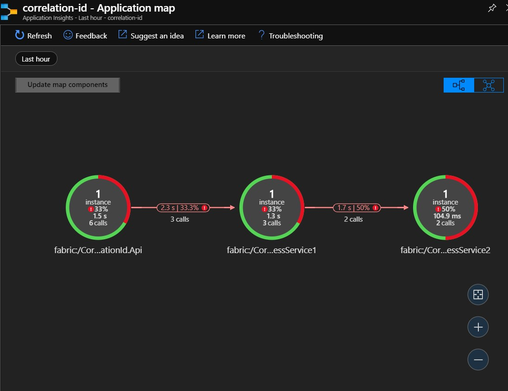
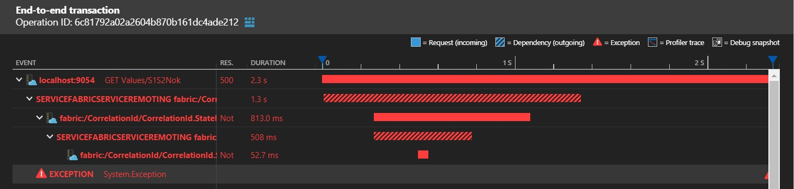

# Service Fabric services request correlation

## 1. Introduction

An Azure cloud offers a service - [Application Insights](https://docs.microsoft.com/en-us/azure/azure-monitor/app/app-insights-overview) - which is able to trace application logs, correlate them, show dependencies, etc. One of its many features is displaying an [Application Map](https://docs.microsoft.com/en-us/azure/azure-monitor/app/app-map). When platform consists of multiple microservices it is easier to analyze logs, when there is trace visualization. A Service Fabric platform implement RPC with its own framework. Here I want to show how to implement tracing requests through Service Fabric Remoting and display it on an Application Insights.

## 2. Prerequisits

To fully understand this example, you need to be aware of:
* Service Fabric platform 
* Stateless Native service
* Remoting
* Application Insights

## 3. Nugets

Most of functionality can be achieved by installing nuget packages. Install following packages in you stateless service:
* Microsoft.ApplicationInsights
* Microsoft.ApplicationInsights.DependencyCollector
* Microsoft.ApplicationInsights.ServiceFabric.Native
* Microsoft.ServiceFabric.Services.Remoting

## 4. Code changes

Add following lines to stateless service constructor.
```
TelemetryConfiguration.Active.TelemetryInitializers.Add(
    FabricTelemetryInitializerExtension.CreateFabricTelemetryInitializer(Context)
);
TelemetryConfiguration.Active.InstrumentationKey = instrumentationKey;
TelemetryConfiguration.Active.TelemetryInitializers.Add(new OperationCorrelationTelemetryInitializer());
TelemetryConfiguration.Active.TelemetryInitializers.Add(new HttpDependenciesParsingTelemetryInitializer());

new DependencyTrackingTelemetryModule().Initialize(TelemetryConfiguration.Active);
new ServiceRemotingRequestTrackingTelemetryModule().Initialize(TelemetryConfiguration.Active);
new ServiceRemotingDependencyTrackingTelemetryModule().Initialize(TelemetryConfiguration.Active);
```

## 5. Results

After that you can  run your app and view traces on an Application Insights. Each service will have it own representation. All calls can be tracked through all properly configured services.

Furthermore, a single call to public API can be traced as an end to end transaction through all services.
